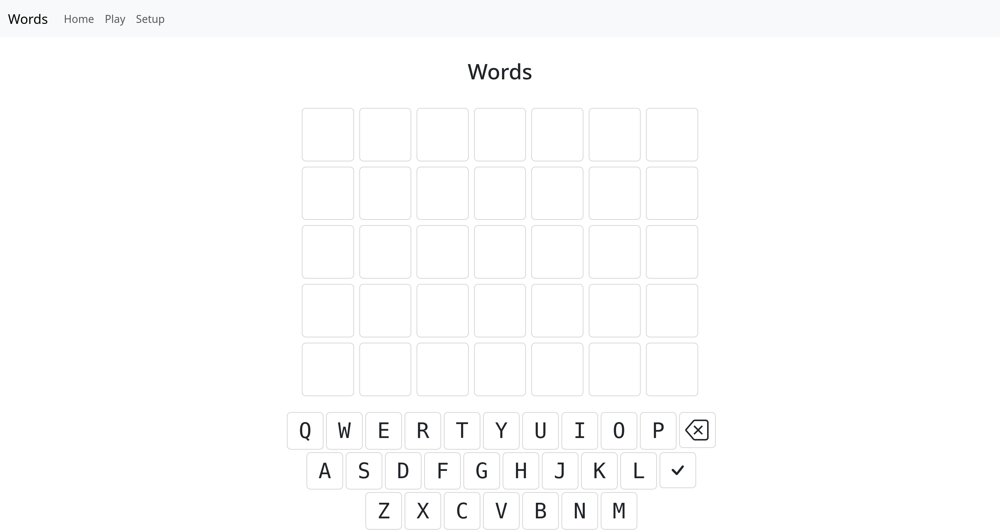

# Words

Self-hosted Wordle clone

This program is a work-in-progress. It is functional, but there's more work needed.

Done:

- The game itself
- Guessed word rotation
- Random word picking
- Color coding of guesses
- JSON word databases

To do:

- Other database formats (written, but not implemented)
- Other settings
- Keyboard color coding
- Hiding of keyboard on mobile devices
- Setup via environment variables instead of config
- Docker container
- Color legend
- Ability to add new words
- Animations

